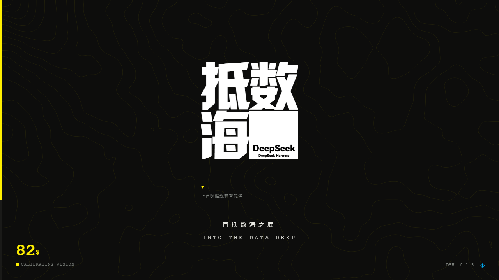

# 抵数海 · dsh-theme-dishuhai

> **直抵数海之底 · Into the data deep**
>
> 一个为 [DeepSeek Harness](https://github.com/deepseek-ai/deepseek-harness)（DSH）Web 界面打造的**双模式主题**：
>
> | 模式 | 风格 | 启动页 |
> |---|---|---|
> | 🌙 **深色** | 终末地工业风（近黑底 · 信号黄 · 直角工业排版 · 等高线地形纹理）| 「抵数海」（黄条进度 · 黄块扫屏转场）|
> | ☀️ **浅色** | **DeepSeek 官网风**（白蓝配色 · 呼吸网格 · 大圆角）| **粒子鱼**（粒子汇聚 → 实体白鲸 → 眨一眼）|



---

## ✨ 特性

### 🌙 深色模式 · 终末地工业风
- **近黑底 + 信号黄**：`#0d0d0c` 打底，`#ffef00` 只做"信号"（按钮、焦点、选中、进度）
- **三色工业条**：顶部 3px 的洋红/黄/青三段标记
- **等高线地形层**：值噪声 + fBm 高度场 → marching squares 提取 20+ 层等值线（canvas 装饰层）
- **会话区网格**：88px 宽幅 + 交点微点阵（`background-attachment: fixed`，滚动不漂移）

### ☀️ 浅色模式 · DeepSeek 官网风
- **官方配色**（取自 deepseek.com）：背景 `#F6FAFD` · 卡片 `#FFFFFF` · 次级块 `#E6EEF7` · 边框 `#D5E1F1`
- **深蓝黑正文** `#283755`（非纯黑，长时间阅读更柔和）· 次要文字 `#5A6B85`
- **DeepSeek 蓝强调** `#4176E6`（按钮、链接、选区、焦点环）
- **官网同款呼吸网格**：88px 淡格 + 交点"白圆套小蓝点"（线在圆点周围断开，留出呼吸缝）
- **大圆角**：气泡 14px / 输入区 16px

### 🚀 双启动页（Splash）
| | 🌙 深色模式 | ☀️ 浅色模式 |
|---|---|---|
| 主视觉 | 「抵数海」三字错落 Logo | **粒子鱼**（2600 粒子汇聚）|
| 过程 | 黄条进度（与真实就绪联动）→ 满格停顿 → **黄块从左扫屏** → 揭幕 | 粒子错峰飞入 → **实体化成白鲸** → **眨一下眼** → 文字淡入 |
| 标语 | — | DSH 探索未至之境 / Into the unknown |

**技术亮点**：
- 进度条与**真实就绪状态**联动（未就绪缓慢逼近 88%，就绪后从容补满）
- 粒子鲸鱼从**官方 Logo 的 SVG 子路径**精确采样（外轮廓/肚子/眼睛/眼斑 4 条子路径）
- **眼睛坐标来自几何计算**（`14.466, 11.249`），非像素猜测；闭眼 = 精确填蓝子路径
- 实体白鲸的白色是**真实填充**（不依赖背景色）——深色背景下依然雪白
- 支持 `prefers-reduced-motion`（减少动效）

---

## 📦 安装

> 本插件是 **DSH 第三方社区插件**，非深度求索官方产品。

### 方式一：放入 profile 的 node_modules（推荐）

```bash
# 把本仓库克隆/复制到 DSH profile 的 node_modules 下
# 例如：C:\Users\<你>\.dsh\profiles\web\node_modules\dsh-theme-dishuhai

# 并在 profile 的 cordis.patch.yml 中注册：
# - insert:
#     - id: theme-dishuhai
#       name: 'dsh-theme-dishuhai'
```

### 方式二：作为本地 workspace 包

```bash
cd ~/.dsh/profiles/web
pnpm add file:/path/to/dsh-theme-dishuhai
```

**安装后刷新浏览器页面即可生效**（client 插件无需重启 DSH）。

---

## ⚙️ 配置与调试开关

### URL 参数

| 参数 | 作用 |
|---|---|
| `?splash=hold` | **定格启动页**（不自动淡出）——调样式时用 |
| `?splash=off` | 关闭启动页 |
| `?static=1` | 启动页静态终态（无头截图/预览用）|
| `?blink=1` | 强制闭眼（验证粒子鱼眨眼效果）|

### localStorage 开关

| 键 | 值 | 作用 |
|---|---|---|
| `dsh-theme-endfield-texture` | `"0"` | 关闭背景纹理（网格） |
| `dsh-theme-endfield-contour` | `"1"` | 深色模式主界面开启等高线层（默认关） |

---

## 🛠️ 开发说明

```
lib/
├── index.js      # host 侧（空壳，所有工作在 client 侧）
└── client.js     # client 侧：CSS 注入 + token 覆盖 + 双启动页 + 网格
assets/
└── logo.png      # 「抵数海」Logo
```

**关键实现点**：

1. **token 双套值**：`ctx.theme.overrideTokens()` 的每个 token 都提供 `{light, dark}` 两套值 → 跟随用户主题设置（**不要**额外调用 `setTheme()`，否则会覆盖用户选择）
2. **CSS 就地更新**：`<style data-plugin-css="...">` 只创建一次、每次替换 `textContent`，改样式**刷新即生效**
3. **主题分发**：`body[data-ds-dark-theme]` 存在 → 深色（抵数海）；否则浅色（粒子鱼）
4. **网格固定**：`background-attachment: fixed`（DSH 在 `[data-conversation-scroll]` 布局下滚动由外层接管，普通背景会随内容漂移）
5. **鲸鱼绘制**：4 条 SVG 子路径分别填充——白色层（肚子/眼睛/眼斑）+ 蓝色 evenodd 主体 + 闭眼时精确填蓝
6. **就绪检测**：`#root` 出现子元素 + 最短展示时长 → 进度补满 → 转场/淡出

---

## 📄 许可（License）

本项目采用**双许可**：

| 范围 | 许可 |
|---|---|
| **代码** | [MIT](./LICENSE-CODE) |
| **内容**（Logo、文案、设计） | [CC BY-NC 4.0](./LICENSE-CONTENT) |

### ⚠️ 整体禁止商业使用

- Logo 字形来自**汉仪字库**（依《汉仪字库个人非商用许可协议》使用，**本项目不含任何字体文件**）
- 浅色模式视觉语言致敬 **deepseek.com** 官网；深色模式致敬《明日方舟：终末地》（鹰角网络）
- 本项目为**非商业爱好者作品**；商用请自行解决字体等相关授权

**素材署名详见 [CREDITS.md](./CREDITS.md)** —— 使用或分发本项目时请完整保留。

---

## 🙏 致谢

- **DeepSeek（深度求索）** — 运行平台与浅色模式的视觉语言来源（官网配色 / 鲸鱼 Logo）
- **汉仪字库** — 「抵数海」Logo 字形所用字体
- **Nuclear_Creeper** — 在线大字生成工具 <https://ark.ncreeper.top/>
- **鹰角网络** — 《明日方舟：终末地》美术风格致敬对象
- **ymh0000123** — [dsh-theme-endfield](https://github.com/ymh0000123/dsh-theme-endfield)（MIT），等高线设计与设计语言整理的重要参考

---

*Made with 🐋 by 哈哈鲸 · 抵数海项目*
